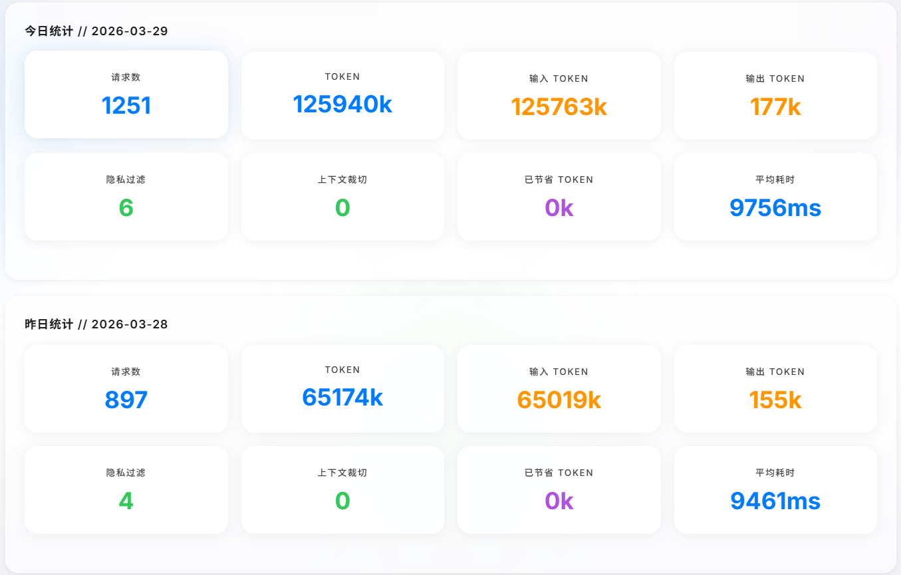
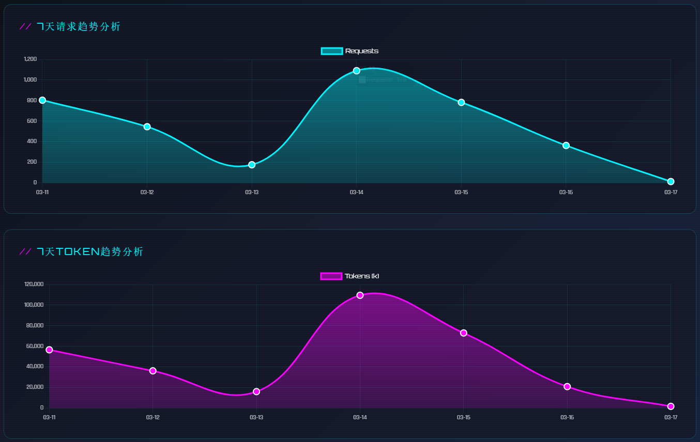
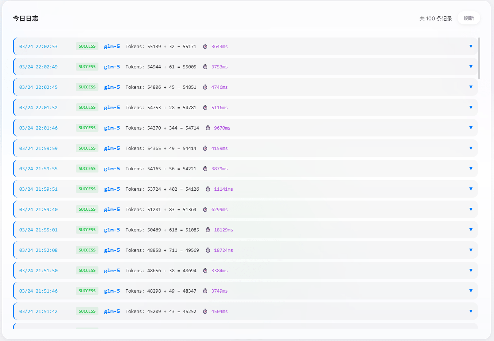
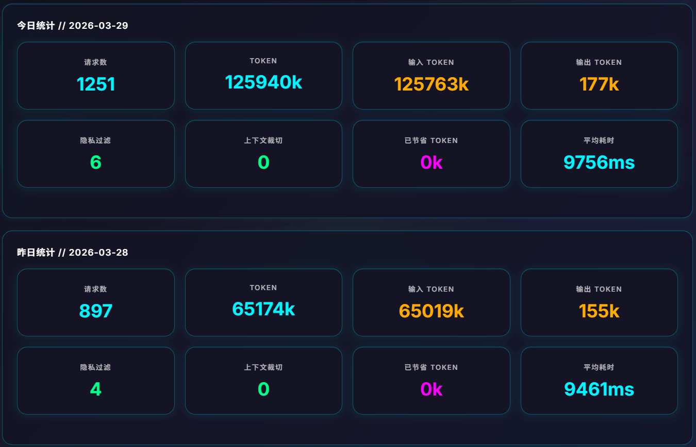
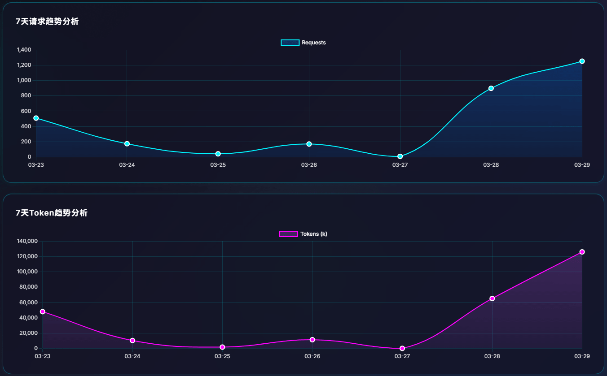
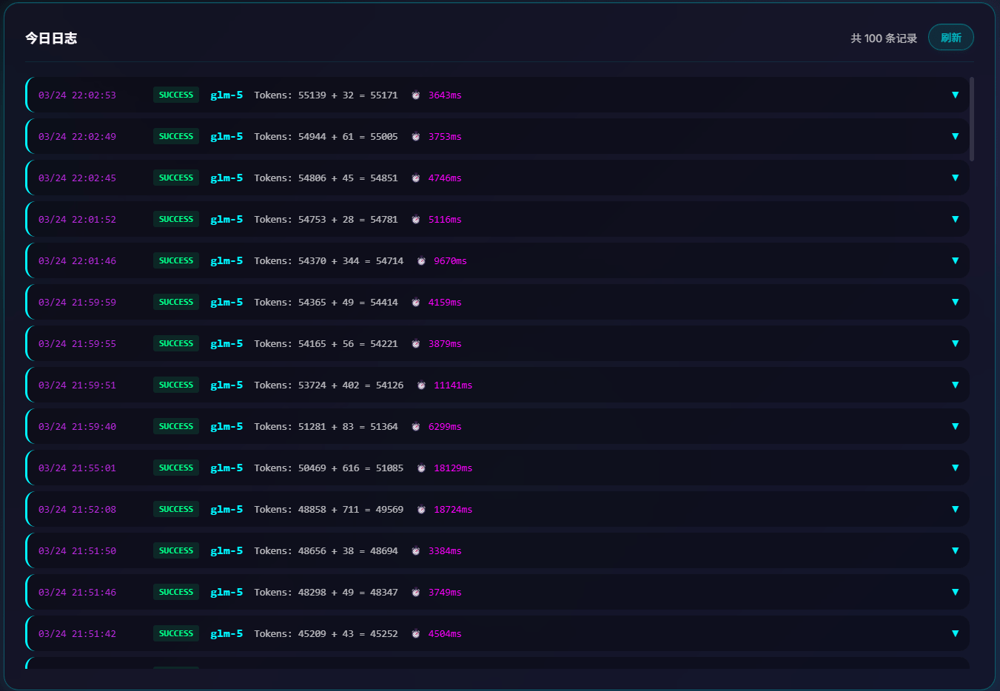

# Savor

> 兼容 OpenAI 和 Anthropic 协议的 LLM 代理网关 - 省钱、省 Token、实时监控

## 简介

Savor 是一个轻量级代理网关，位于客户端和大模型 API 之间，提供循环保护、限流控制、成本监控等功能。同时支持 OpenAI Chat Completions API 和 Anthropic Messages API 协议，可与 OpenClaw、Claude Code 等客户端无缝对接。

## 功能特点

- **双协议支持** - 同时支持 OpenAI 和 Anthropic 协议，独立配置互不干扰
- **透明代理** - 转发客户端到大模型 API 的所有请求
- **循环保护** - 自动检测并打断工具调用无限循环，避免 Token 浪费
- **限流控制** - 基于客户端 IP 独立限流，支持永久锁定或定时解锁
- **上下文截断** - 只保留最近 N 轮对话，节省 Token
- **命令系统** - 通过特殊前缀触发特定行为（如 `\翻译` 截断上下文）
- **隐私过滤** - 自动过滤手机号、身份证、邮箱等敏感信息
- **实时监控** - Web 看板显示请求统计、Token 消耗、成本分析
- **HTTPS 支持** - 双端口运行，支持自签名证书或自有域名证书
- **API Key 保护** - 替换 API Key，真实 Key 仅存储在 Savor

## 兼容性说明

Savor 支持两种协议：

### OpenAI 协议

完全兼容 OpenAI Chat Completions API 协议：
- ✅ OpenClaw
- ✅ 任意使用 OpenAI SDK 的应用
- ✅ LangChain、LlamaIndex 等框架的 OpenAI 集成

### Anthropic 协议

完全兼容 Anthropic Messages API 协议：
- ✅ Claude Code
- ✅ 任意使用 Anthropic SDK 的应用

工作原理：
1. 接收客户端请求（OpenAI 或 Anthropic 格式）
2. 透明转发至配置的上游 API
3. 返回对应格式的响应
4. 中间层提供循环保护、限流、监控等功能

**浅色模式：**







**深色模式：**







## 快速开始

### 安装

```bash
git clone https://github.com/chziyue/savor.git
cd savor
npm install
npm run build
```

### 配置

修改 `config.js`：

```javascript
module.exports = {
  // OpenAI 协议配置
  upstream: 'https://api.example.com/v1',  // OpenAI 协议上游 API 地址
  
  // Anthropic 协议配置
  anthropicUpstream: 'https://api.example.com/',  // Anthropic 协议上游 API 地址
  
  port: 3456,
  host: '0.0.0.0',
  
  modelOverride: { enabled: false, model: '' },
  apiKeyOverride: { enabled: false, apiKey: '' },
  anthropicModelOverride: { enabled: false, model: '' },
  anthropicApiKeyOverride: { enabled: false, apiKey: '' }
};
```

两种协议独立配置，互不干扰。

## 启动方式

### 方式一：直接启动

适合开发测试，关闭终端后进程结束。

| 操作 | 命令 |
|------|------|
| 启动 | `npm start` |
| 停止 | `Ctrl + C` |

### 方式二：PM2 启动（推荐）

适合生产环境，后台运行，自动重启。

**安装 PM2**：
```bash
npm install -g pm2
```

**常用命令**：

| 操作 | 命令 |
|------|------|
| 启动 | `pm2 start ecosystem.config.js` |
| 停止 | `pm2 stop savor` |
| 重启 | `pm2 restart savor` |
| 查看状态 | `pm2 status` |
| 查看日志 | `pm2 logs savor` |
| 查看实时日志 | `pm2 logs savor --lines 50` |
| 开机自启 | `pm2 startup` 然后 `pm2 save` |

### 访问监控看板

```
http://localhost:3456/
```

## 与客户端集成

### OpenAI 协议客户端

Savor 兼容 OpenAI Chat Completions API 协议，支持以下客户端：

**OpenClaw**：

```json
// ~/.openclaw/openclaw.json
{
  "models": {
    "providers": {
      "qwen": {
        "baseUrl": "http://your-server:3456/v1",
        "apiKey": "sk-xxx"
      }
    }
  }
}
```

**其他 OpenAI 协议客户端**：

任何支持 OpenAI Chat Completions API 的客户端均可使用，配置方式：
- **API Base URL**: `http://your-server:3456/v1`
- **API Key**: 任意值（如 `sk-xxx`）
- **Model**: 根据实际上游模型配置

**注意**：OpenAI 协议代理地址必须以 `/v1` 结尾。

### Anthropic 协议客户端

**Claude Code**：

```json
// ~/.claude/settings.json
{
  "apiConfiguration": {
    "baseURL": "http://your-server:3456"
  }
}
```

**其他 Anthropic 协议客户端**：

任何支持 Anthropic Messages API 的客户端均可使用，配置方式：
- **API Base URL**: `http://your-server:3456`
- **API Key**: 通过 `x-api-key` header 或 `anthropicApiKeyOverride` 配置

**注意**：Claude Code 客户端配置代理地址不能以 `/v1` 结尾。

## 限流 API

启用限流后，可通过 API 管理客户端状态：

```bash
# 查看所有客户端状态
curl http://localhost:3456/rate-limit/status | jq .

# 查看特定客户端状态
curl "http://localhost:3456/rate-limit/status?clientId=192.168.1.100" | jq .

# 解锁特定客户端
curl -X POST "http://localhost:3456/rate-limit/reset?clientId=192.168.1.100" | jq .

# 解锁所有客户端
curl -X POST "http://localhost:3456/rate-limit/reset?all=true" | jq .
```

## 配置热更新

修改 `config.js` 后，**所有配置项无需重启服务即可生效**：

- `upstream` / `upstreamAppendV1` - OpenAI 上游地址
- `anthropicUpstream` / `anthropicUpstreamAppendV1` - Anthropic 上游地址
- `modelOverride` / `anthropicModelOverride` - 模型替换
- `apiKeyOverride` / `anthropicApiKeyOverride` - API Key 替换
- `loopGuard` - 循环保护（熔断阈值、时间窗口）
- `rateLimit` - 限流配置（请求限制、锁定时间）
- `contentFilter` - 内容过滤
- `contextTruncation` - 上下文截断
- `tokenEstimation` - Token 估算系数
- `timeout` - 超时配置
- `commands` - 命令系统
- `cors` - CORS 白名单
- `dashboard` - Dashboard 配置
- `fullTrace` - 全链路追踪
- `logLevel` - 日志级别

**仍需重启的配置项**：
- `port` / `host` - 端口和地址绑定
- `https` - HTTPS 证书配置
- `features` - 功能开关（stats、webDashboard）
- `logDir` - 日志目录

服务启动后会自动监听 `config.js` 文件变化，检测到变化后 1 秒内自动加载新配置。

日志中会显示：
```
[ConfigWatcher] config.js 文件已变化
[ConfigWatcher] 配置已热更新 ["rateLimit", "contentFilter"]
[Proxy] 配置已热更新 ["rateLimit", "contentFilter"]
```

## HTTPS 配置

### 自签名证书

```bash
mkdir -p certs
openssl req -x509 -nodes -days 36500 -newkey rsa:2048 \
  -keyout certs/key.pem -out certs/cert.pem \
  -subj "/C=CN/O=Savor/CN=savor.local" \
  -addext "subjectAltName=IP:192.168.1.100"
chmod 600 certs/key.pem
```

macOS 需配置环境变量跳过证书验证：

```bash
plutil -insert EnvironmentVariables.NODE_TLS_REJECT_UNAUTHORIZED -string "0" ~/Library/LaunchAgents/ai.openclaw.gateway.plist
launchctl unload ~/Library/LaunchAgents/ai.openclaw.gateway.plist
launchctl load ~/Library/LaunchAgents/ai.openclaw.gateway.plist
```

### 自有域名证书

将证书放入 `certs/` 目录，修改 `config.js`：

```javascript
https: {
  enabled: true,
  port: 3457,
  keyPath: './certs/key.pem',
  certPath: './certs/cert.pem'
}
```

## 使用 Docker 启动（推荐）

无需安装 Node.js，直接使用 Docker 部署。

### 步骤

```bash
# 1. 创建目录
mkdir savor
cd savor

# 2. 下载配置文件
curl -O https://raw.githubusercontent.com/chziyue/savor/main/docker-compose.yml
curl -O https://raw.githubusercontent.com/chziyue/savor/main/config.js

# 3. 修改配置文件，添加上游 API 地址
vim config.js
# 或使用其他编辑器修改 upstream 字段

# 4. 启动服务
docker compose up -d
```

### 常用命令

| 操作 | 命令 |
|------|------|
| 查看日志 | `docker compose logs -f` |
| 停止服务 | `docker compose down` |
| 重启服务 | `docker compose restart` |
| 更新镜像 | `docker compose pull && docker compose up -d` |

### 自行构建镜像

如果需要使用本地版本，可以自行构建 Docker 镜像：

```bash
# 1. 克隆仓库
git clone https://github.com/chziyue/savor.git
cd savor

# 2. 构建镜像
docker build -t savor:local .

# 3. 修改 docker-compose.yml 使用本地镜像
# 将 image: chziyue/savor:latest 改为 image: savor:local

# 4. 修改配置文件，添加上游 API 地址
vim config.js
# 或使用其他编辑器修改 upstream 字段

# 5. 启动服务
docker compose up -d
```

## 命令系统

Savor 支持特殊命令前缀，触发特定行为。

### 翻译命令

在对话中输入 `\翻译` 或 `\translate`，会截断上下文，只发送当前消息给大模型：

```
\翻译 This is a sample text to translate.
```

**效果：**
- 截断历史上下文，只发送当前消息
- 大幅节省 Token 消耗
- 大模型看到"翻译"二字，自动翻译后续内容

### 裁切控制命令

使用 `\N` 格式（N 为数字）控制上下文保留轮数：

```
\0 只保留当前消息
\1 保留上一轮完整对话 + 当前
\2 保留上两轮完整对话 + 当前
\5 保留最近五轮完整对话 + 当前
```

**效果：**
- `\0` — 完全截断历史，模型只看到当前输入
- `\1` — 保留最近一轮对话（上一个用户消息 + AI 回复）
- `\N` — 保留最近 N 轮对话，每轮以用户消息为起点

**适用场景：**
- `\0` — 独立问答、不依赖历史的任务
- `\1` — 简单追问、需要上一轮上下文的任务
- `\2` — 多轮对话的复杂任务、代码续写

**注意：** 轮数以用户消息为界，AI 的多条回复（如工具调用）属于同一轮。

**配置：**

```javascript
// config.js
commands: {
  enabled: true,    // 启用命令系统
  prefix: '\\'      // 命令前缀（反斜杠）
}
```

## 版本历史

### v0.6.3 (2026-04-20)

- ✅ 日志页面分页功能：按需加载，基于 timestamp 锚点避免新日志插入导致页偏移
- ✅ 配置文件全项热重载：upstream、loopGuard、rateLimit、contentFilter 等所有配置项修改后立即生效

### v0.6.2 (2026-04-16)

- ✅ 协议从 MIT 迁移至 GPL-3.0-or-later
- ✅ 修复上游响应错误时未检查 status 导致的问题
- ✅ 修复 catch 块中 body 可能为 undefined 的问题
- ✅ 修复 migrateAddColumn SQL 注入风险
- ✅ initStats 添加异常降级处理
- ✅ 删除重复的 filterTextContent，复用 filter.ts 中的 filterText
- ✅ 优化 VACUUM 执行频率，仅在删除超过 1000 条记录时执行
- ✅ 删除未使用的 RateLimiter 导入
- ✅ 提取 Token 估算字符正则为常量

### v0.6.1 (2026-04-12)

- ✅ 新增配置文件热更新，修改 config.js 后无需重启服务自动生效
- ✅ 支持 modelOverride、anthropicModelOverride、apiKeyOverride、anthropicApiKeyOverride 热更新

### v0.6.0 (2026-04-12)

- ✅ 新增 Anthropic Messages API 协议支持
- ✅ 双协议独立配置，互不干扰
- ✅ 命令系统支持 Anthropic 协议（`\翻译`、`\N` 裁切控制）
- ✅ 默认限流改为 100 req/min，避免并行任务触发限流

### v0.5.7 (2026-04-04)

- ✅ 重构循环保护：移除缓存功能，简化为计数+熔断
- ✅ 熔断阈值从 4 次改为 3 次
- ✅ 修复正则 test+replace 连用导致敏感信息过滤遗漏
- ✅ 修复限流 retryAfter 语义错误，新增 lockedDuration 字段
- ✅ 添加 StatsDatabase.queryOne 公共方法，移除私有属性访问
- ✅ 简化上游 URL 拼接，配置统一以 `/v1` 结尾
- ✅ 添加 WriteQueue 队列上限保护，防止内存溢出

### v0.5.6 (2026-04-04)

- ✅ Token 估算系数微调 (digitChar:0.6, jsonStructChar:0.7)
- ✅ 删除未使用的 dashboard-themed.ts

### v0.5.5 (2026-04-03)

- ✅ Token 估算改用批量正则匹配，性能优化
- ✅ 修复配置文件 tokenEstimation 不生效问题
- ✅ 修复异步写入队列遗漏 daily_stats 更新
- ✅ Token 估算系数校准（1.0/0.5/0.5/0.5）

### v0.5.4 (2026-04-02)

- ✅ 新增异步写入队列 (WriteQueue)，支持定时批量写入
- ✅ 队列超过阈值立即触发（默认 100 条）
- ✅ 优雅关闭时自动 flush
- ✅ 12 个单元测试覆盖

### v0.5.3 (2026-04-01)

- ✅ 提取魔法数字为命名常量（temperature/top_p/penalty 范围）
- ✅ Schema 导出推断类型，提高类型安全性
- ✅ 提取主题共享常量，减少重复代码
- ✅ 主题配置缓存，避免每次请求读文件
- ✅ LogBatch 改为真正批量写入，减少系统调用
- ✅ TTLMap 添加自动清理机制，防止内存泄漏
- ✅ RateLimiter 添加闲置用户清理，防止用户数据无限增长

### v0.5.2 (2026-03-31)

- ✅ 新增裁切控制命令 `\N`，支持 `\0` `\1` `\2` 等灵活控制上下文保留轮数
- ✅ 改进截断逻辑：以用户消息为轮起点，确保每轮完整
- ✅ Context 标记显示具体轮数（如 `Context 0` `Context 2`）

### v0.5.1 (2026-03-30)

- ✅ 新增命令系统，支持 `\翻译` 触发上下文截断
- ✅ 支持 `\translate` 英文别名
- ✅ 修复 `truncateContext(messages, 0)` 边界问题

### v0.5.0 (2026-03-28)

- ✅ 新增 Glass 玻璃主题，设为默认主题
- ✅ 新增 Docker 部署支持（Dockerfile + docker-compose.yml）
- ✅ 新增 GitHub Actions CI 工作流
- ✅ 新增测试框架和 ESLint
- ✅ 修复流式请求 token 统计为 0 的问题
- ✅ 修复 TypeScript 类型定义
- ✅ 修复生产环境运行 dist 代码
- ✅ 容器时区支持，修复统计数据日期查询问题
- ✅ 文档更新：Docker 部署指引、限流 API、暗色模式截图

<details>
<summary>历史版本</summary>

### v0.4.1 (2026-03-16)

- ✅ 新增 API Key 替换功能，保护真实 Key 不在网络上传输

### v0.4.0 (2026-03-16)

- ✅ 新增 HTTPS 支持（双端口：HTTP 3456 + HTTPS 3457）
- ✅ 支持自签名证书和自有域名证书

### v0.3.10 (2026-03-16)

- ✅ 修复 7 天趋势图显示 8 天数据的问题

### v0.3.9 (2026-03-16)

- ✅ 添加详细错误日志（errorName、cause、causeCode 等）
- ✅ 方便排查网络问题（如 EHOSTUNREACH）

### v0.3.8 (2026-03-14)

- ✅ 定时清理 8 天前数据
- ✅ 排除数据库文件跟踪
- ✅ UI 微调

### v0.3.7 (2026-03-14)

- ✅ 日志页双滚动条修复
- ✅ Token 趋势图显示整数
- ✅ 过滤标记改进

### v0.3.6 (2026-03-14)

- ✅ Pino 结构化日志
- ✅ 依赖注入模式
- ✅ 数据库索引优化

### v0.3.5 (2026-03-13)

- ✅ CORS 白名单安全机制

### v0.3.4 (2026-03-13)

- ✅ Helmet 安全中间件
- ✅ Zod 输入验证
- ✅ 全局错误处理

### v0.3.3 (2026-03-13)

- ✅ Token 估算优化
- ✅ 日志页重构

### v0.3.2 (2026-03-12)

- ✅ 主页统计重构

### v0.3.1 (2026-03-11)

- ✅ 过滤系统精简

### v0.3.0 (2026-03-11)

- ✅ 内容过滤系统

### v0.2.2 (2026-03-10)

- ✅ 日志页面交互优化

### v0.2.1 (2026-03-09)

- ✅ 上下文截断

### v0.2.0 (2026-03-09)

- ✅ 多用户限流

### v0.1.0 (2026-03-07)

- ✅ 配置文件简化
- ✅ Web 看板优化
- ✅ 全链路追踪

### v0.0.1 (2026-03-05)

- ✅ 初始版本

</details>

---

## 许可证

[GPL-3.0-or-later](LICENSE)

---

_Project: Savor_
_Protocol: OpenAI & Anthropic API Compatible_
